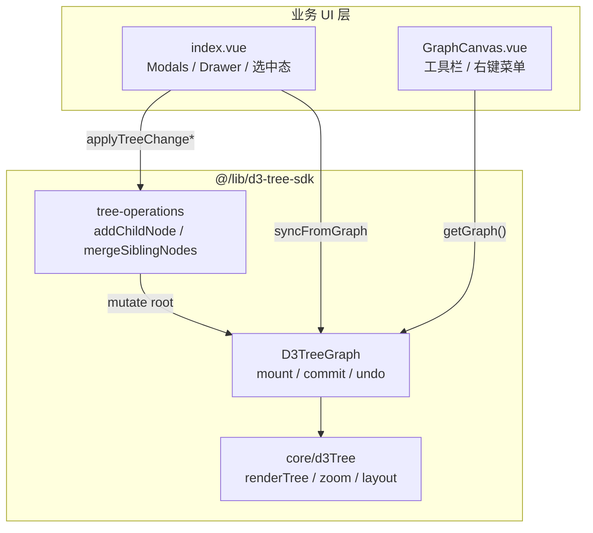

# D3 Tree SDK — 核心设计与实现

> 框架无关的 D3 v7 树形图 SDK，适用于 Vue2 / Vue3 / React / 原生 JS。  
> 源码目录：`src/lib/d3-tree-sdk/`

---

## 1. 设计目标

| 目标 | 说明 |
|------|------|
| **框架无关** | 渲染、数据、历史与树操作不依赖 Vue/React |
| **单一数据源** | `D3TreeGraph` 内部持有 `TreeData`，页面通过 `mutateData()` + `commit()` 变更 |
| **纯函数操作** | `tree-operations.ts` 可单独单元测试，不触碰 DOM |
| **可嵌入** | 业务页（`index.vue`）只负责 UI；SDK 负责 D3 与数据结构 |

---

## 2. 目录结构

```
src/lib/d3-tree-sdk/
├── D3TreeGraph.ts      # 主类：生命周期、事件、视图、历史
├── tree-operations.ts  # 纯函数：增删改、合并、关系
├── HistoryStack.ts     # 撤销/重做栈
├── EventEmitter.ts     # 轻量事件总线
├── core/
│   ├── d3Tree.ts       # D3 初始化、布局、拖拽、渲染
│   └── treeLogger.ts   # 调试日志
├── types/index.ts      # TreeData、LevelKey、合并规则等
├── data/
│   └── initialTreeData.ts
├── index.ts            # 统一导出
└── docs/
    └── SDK-CORE.md     # 本文档
```

---

## 3. 分层架构



---

## 4. 字段配置（TreeConfig）— 对接不同后端

此前 SDK 写死了 `id` / `parentId` / `'edu'` 等；现已改为**可传入配置**。

### 4.1 配置结构

```typescript
import type { TreeConfigInput } from '@/lib/d3-tree-sdk';

const treeConfig: TreeConfigInput = {
  rootId: 'edu',              // 根节点 id（整合模块 fallback 父级）
  protectedRootId: 'edu',     // 不可删除节点
  fields: {
    id: 'id',                 // 若后端是 nodeId → 'nodeId'
    label: 'label',           // 若后端是 name → 'name'
    children: 'children',
    modules: 'modules',
    relationTargetId: 'targetId',
    // ...
  },
  selection: {
    id: 'id',
    label: 'label',
    parentId: 'parentId'      // 若多选项用 pid → 'pid'
  },
  defaults: { dept: '教育局', moduleLevel: 'module' },
  idPrefix: { node: 'node_', module: 'module_', merge: 'merge_' }
};
```

### 4.2 传入方式

```typescript
const graph = new D3TreeGraph({
  container: '#graph',
  data: treeData,
  treeConfig
});

// 业务操作用同一 context
const ctx = graph.getContext();
ctx.addChildNode(root, { parentId: '...', ... });
```

### 4.3 data-d3 页面配置

业务页统一在 **`src/pages/data-d3/config/treeConfig.ts`** 维护，GraphCanvas / index.vue 共用 `DATA_D3_TREE_CONFIG`。

对接外部 API 时：

- 树节点字段 → 改 `fields`
- 多选/整合模块的父级字段 → 改 `selection.parentId`（如 `'pid'`）
- 根节点 → 改 `rootId` / `protectedRootId`

### 4.4 TreeContext 与 Accessors

| 组件 | 职责 |
|------|------|
| `TreeConfig` | 解析 defaults、字段名、rootId |
| `TreeAccessors` | `getId` / `getChildren` / `getRelations` 等读写 |
| `TreeContext` | 封装 find / add / merge / delete 等全部树操作 |
| `selection.ts` | `normalizeSelectedItem` 对接外部选中项 |

---

## 5. 核心类：`D3TreeGraph`

### 5.1 生命周期

```typescript
import { D3TreeGraph, initialTreeData } from '@/lib/d3-tree-sdk';

const graph = new D3TreeGraph({
    container: '#graph-container', // 或 HTMLElement
    data: initialTreeData,
    protectedRootId: 'edu',        // 不可删除的根节点
    enableHistory: true            // 默认开启撤销/重做
});

graph.on('node:click', (node) => console.log(node.label));
graph.mount();   // 创建 SVG、绑定 zoom、首次 renderTree

// 销毁
graph.destroy();
```

### 5.2 数据变更模式（最重要）

```typescript
// ① 取得可写根节点（与 graph 内部 data 同一引用）
const root = graph.mutateData();

// ② 调用纯函数修改（见第 5 节）
addChildNode(root, {
    parentId: 'app1',
    name: '新应用',
    level: 'dept_single',
    integrationType: 'merge'
});

// ③ 提交：重绘 + 可选写入历史栈 + 触发 data:change
graph.commit({ recordHistory: true });
```

**Vue 页面封装（index.vue 同款）：**

```typescript
function applyTreeChange(mutator: (root: TreeData) => boolean): boolean {
    const graph = getGraph();
    if (!graph) return false;
    const ok = mutator(graph.mutateData());
    if (!ok) return false;
    graph.commit({ recordHistory: true });
    treeData.value = graph.getData(); // syncFromGraph
    return true;
}
```

### 5.3 视图与布局

| 方法 | 作用 |
|------|------|
| `zoomIn()` / `zoomOut()` | 缩放 |
| `fitView()` | 适应容器 |
| `resetZoom()` | scale(1) 居中 |
| `toggleOrientation()` | 横/纵布局切换 |
| `setOrientation('vertical')` | 指定布局 |

### 5.4 历史栈

| 方法 | 作用 |
|------|------|
| `recordHistory()` | 手动压栈 |
| `undo()` / `redo()` | 撤销/重做（内部已 render） |
| `canUndo()` / `canRedo()` | 按钮 disabled 状态 |
| `refresh()` | 恢复 `initialData` |

---

## 6. 树操作（TreeContext / tree-operations）

| 函数 | 说明 |
|------|------|
| `findNodeInTree(root, nodeId)` | 递归查找，返回 `{ node, parent, depth }` |
| `collectDescendantApps(root, excludeId?)` | 收集子树节点（绑定关系下拉） |
| `addChildNode(root, input)` | 新增子节点 |
| `addModule(root, input)` | 新增功能模块 |
| `integrateSelectedModules(root, input)` | 多选模块整合为一个 |
| `editNode(root, input)` | 编辑 label/dept/level/owner |
| `bindRelation(root, input)` | 追加 relations |
| `setNodeIntegration(root, nodeId, type)` | 标注整合方式 |
| `mergeSiblingNodes(root, input)` | 拖拽/弹框同级合并 |
| `deleteNodeFromTree(root, nodeId, protectedRootId?)` | 删除节点 + 清理 relations 引用 |
| `removeRelationsToNode(root, deletedId)` | 全树移除指向某 id 的关系 |

### 合并示例

```typescript
const result = mergeSiblingNodes(root, {
    name: '合并后的应用',
    integrationType: 'merge',
    sourceId: 'node_a',
    targetId: 'node_b'
});

if (!result.ok) {
    alert(result.message);
} else {
    selectNode(result.node!);
    graph.commit();
}
```

### 合并层级规则

由 `canSiblingMerge()` 控制（见 `types/index.ts`）：

- 根节点的直接子节点：父节点 `integratedFrom` 含 `ROOT_DEFAULT_MERGE_MARKER` 才可合并
- 更深层级：父节点必须是已合并节点（`isMergedNode`）
- 保证「先合并上层，再合并下层」

---

## 7. D3 渲染层（`core/d3Tree.ts`）

| 导出 | 作用 |
|------|------|
| `initD3(...)` | 创建 SVG、g、zoom、tree layout |
| `renderTree(instance, data, callbacks...)` | keyed join 重绘节点/连线 |
| `setTreeOrientation(instance, orientation)` | 切换横/纵布局尺寸 |

**关键实现要点：**

1. **Keyed join**：节点用 `data-id` 与 schema 配置的 id 字段对齐，避免拖拽后 DOM 错位  
2. **拖拽跟手**：`clientToGraphLocal(graphG, clientX, clientY)` 将指针转为 zoom 容器局部坐标，不依赖 `event.dx / k`  
3. **落点检测**：DOM 命中（`elementsFromPoint` + 卡片 `getBoundingClientRect`）→ 坐标回退（同级卡片矩形）  
4. **拖拽遮挡**：拖拽中 `pointer-events: none`，避免被拖节点挡住下方目标  
5. **bindNodeDrag**：每次 render 前解绑旧 listener  
6. **drop-target**：同级命中时 emit `node:drop-target` 给上层打开合并弹框  

### 7.1 拖拽与 zoom 坐标（2026-06-12）

| 阶段 | 关键 API | 说明 |
|------|----------|------|
| dragstart | `nodeScreenPosition` + `clientToGraphLocal` | 记录节点起点与指针起点（图局部坐标） |
| drag | 同上 | `cur = nodeStart + (localNow - localStart)` |
| dragend | `findSameLevelNodeAtDOM` | DOM 优先，未命中走 `findSameLevelNodeByCoord` |

注意：`hNodeId(ctx, node)` 参数为 `HierarchyNode`，不可传 `node.data`。

## 8. 事件列表

订阅方式：`graph.on('event', handler)`，返回 unsubscribe 函数。

| 事件 |  payload | 触发时机 |
|------|----------|----------|
| `node:click` | `TreeData` | 单击节点 |
| `node:dblclick` | `TreeData` | 双击（多选） |
| `node:more` | `{ event, nodeId }` | 右键/更多按钮 |
| `node:drop-target` | `{ sourceId, targetId, sourceData, targetData }` | 拖拽合并 |
| `data:change` | `TreeData` | commit / setData / undo / redo |
| `history:change` | `{ canUndo, canRedo }` | 历史栈变化 |
| `orientation:change` | `'horizontal' \| 'vertical'` | 布局切换 |
| `svg:click` | — | 点击空白 SVG |
| `destroy` | — | destroy() |

---

## 9. Vue 页面集成对照

### 9.1 完整业务页

```
用户操作 → Modals 确认
         → applyTreeChange / applyTreeChangeWithResult
         → tree-operations 纯函数
         → graph.commit()
         → syncFromGraph() 更新 treeData
         → Drawer / 日志 / 选中态更新
```

### 9.2 薄壳演示

仅演示 SDK，无 Modals：

```typescript
graph = new D3TreeGraph({ container: el, data: initialTreeData });
graph.on('node:drop-target', (p) => console.log(p));
graph.mount();
```

路由：`/data-d3/sdk-demo`

### 9.3 GraphCanvas 职责

- 创建并持有 `D3TreeGraph` 实例  
- 工具栏 → 直接调用 `graph.zoomIn()` 等  
- `defineExpose({ getGraph, renderTree, ... })` 供 index.vue 访问  

---

## 10. 最小可运行示例（原生 JS）

```html
<div id="graph" style="width:100%;height:600px"></div>
<script type="module">
import {
    D3TreeGraph,
    initialTreeData,
    addChildNode,
    mergeSiblingNodes
} from '@/lib/d3-tree-sdk';

const graph = new D3TreeGraph({
    container: '#graph',
    data: initialTreeData,
    protectedRootId: 'edu'
});

graph.on('node:drop-target', ({ sourceId, targetId }) => {
    const root = graph.mutateData();
    const result = mergeSiblingNodes(root, {
        name: '合并节点',
        integrationType: 'merge',
        sourceId,
        targetId
    });
    if (result.ok) graph.commit();
    else alert(result.message);
});

graph.mount();
</script>
```

---

## 11. 类型速查

```typescript
interface TreeData {
    id: string;
    label: string;
    level: LevelKey;
    dept?: string;
    owner?: string;
    integrationType?: IntegrationTypeKey;
    integrationTypeName?: string;
    children?: TreeData[];
    modules?: TreeData[];
    relations?: Relation[];
    integratedFrom?: string[];  // 合并来源节点 id
}
```

---

## 12. 调试

```typescript
import { TreeLogger } from '@/lib/d3-tree-sdk';

TreeLogger.setEnabled(true);
TreeLogger.log('操作名', treeData, { detail: '...' });
```

---

## 13. 相关文件

| 文件 | 说明 |
|------|------|
| `src/pages/data-d3/index.vue` | 完整业务页 + SDK 集成参考 |
| `src/pages/data-d3/components/GraphCanvas.vue` | SDK 实例包装 |
| `src/pages/data-d3/sdk-demo/index.vue` | 最小 SDK 演示 |
| `src/lib/d3-tree-sdk/README.md` | API 速查 |

---

## 14. 版本与扩展

**当前已支持：** 横/纵布局、撤销重做、拖拽合并、关系绑定、PNG/SVG 导出  

**扩展建议：**

- 新树操作 → 加到 `tree-operations.ts`，index.vue 用 `applyTreeChange` 调用  
- 新 UI 事件 → `D3TreeGraphEventMap` + `core/d3Tree.ts` emit  
- 新框架 → 复制 `applyTreeChange` 模式，无需改 SDK 内核  
